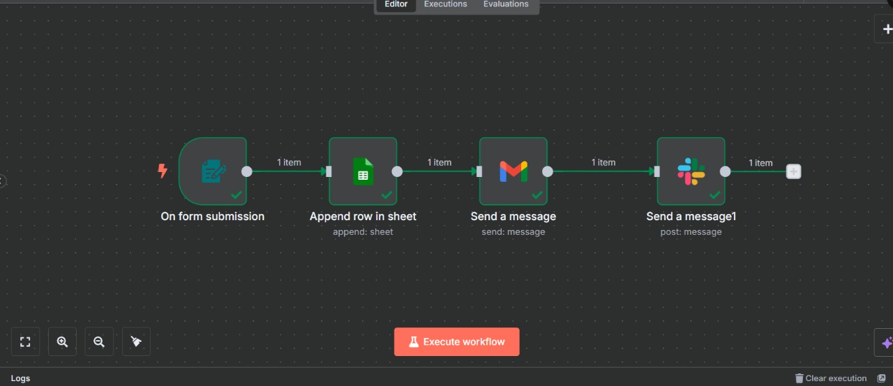

# 🤝 Customer Service Automation System (n8n)

## 📌 Project Overview
This project is a customer service automation system built using **n8n**, designed to streamline user support workflows and reduce manual effort. The system captures customer requests through forms, stores data automatically, and sends notifications to relevant platforms for quick response.

## ⚙️ Workflow Description
The automation workflow performs the following steps:
1. Triggers when a customer submits a support form
2. Stores customer data in Google Sheets
3. Sends automated email notifications
4. Sends real-time alerts to Slack for customer support teams

## 🛠️ Tools & Technologies
- n8n (no-code workflow automation)
- Google Forms
- Google Sheets
- Gmail
- Slack
- Webhooks & API integrations

## 🎯 Use Cases
- Customer support request handling
- Service ticket logging
- Automated internal notifications
- Small business customer service automation

## 📸 Workflow Preview

## 🎥 Demo Video
▶️ Watch the working demo of the Customer Service Automation System:

🔗 [Watch Demo Video on Google Drive](https://drive.google.com/file/d/1DhhKDZAuWMuKFA5GQ7oEx-z6X7FEsYIJ/view?usp=sharing)

## 👩‍💻 Author
Shaily Prasad

